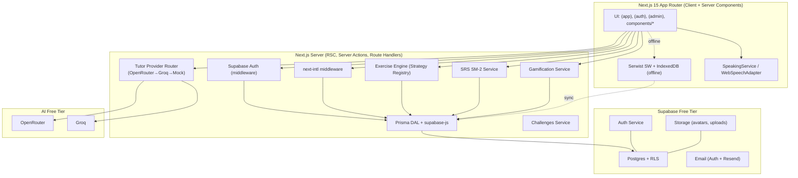
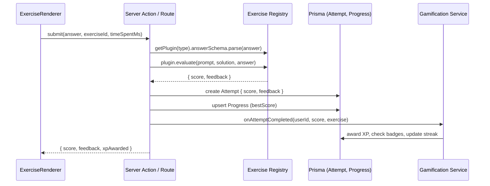
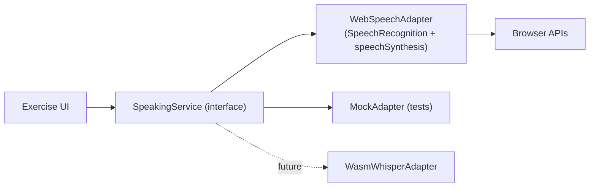
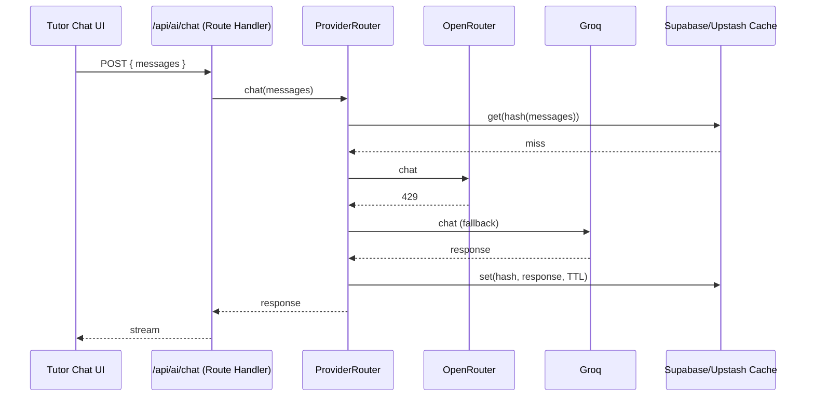
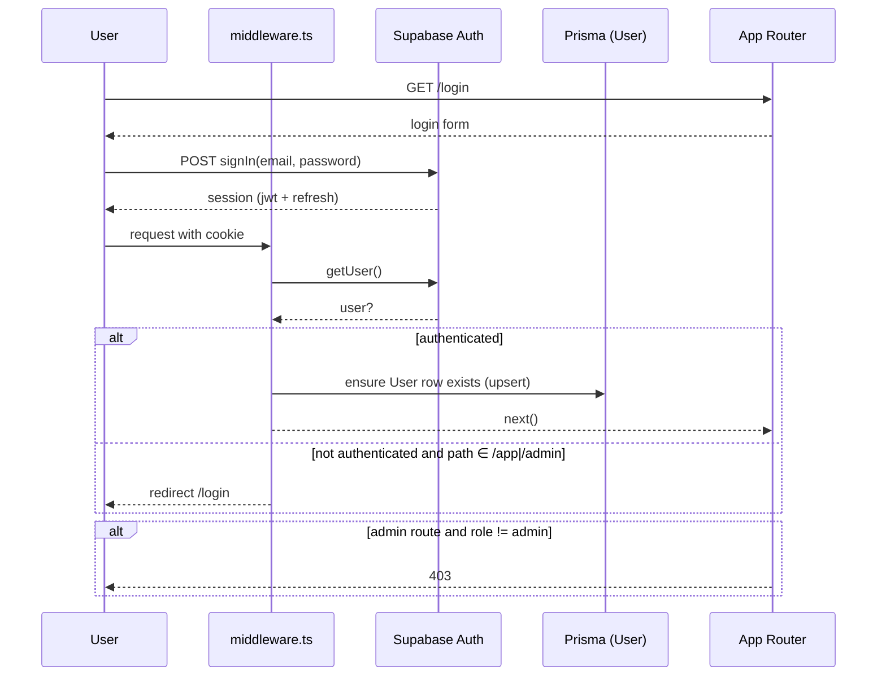

# Design: English Learning Platform

> **Change ID:** `english-learning-platform` · **Phase:** design · **Date:** 2026-09-08 · **Store:** hybrid (file + engram `sdd/english-learning-platform/design`) · **Depends on:** `spec.md` · **Stack:** Next.js 15 App Router · TS strict · Tailwind 4 · Supabase Postgres · Prisma + supabase-js · Supabase Auth · Serwist PWA · Vercel · next-intl · Zustand 5 · Zod 4 · Vercel AI SDK 5

## 1. Architecture Overview

### 1.1 Style

**Modular monolith** — Next.js App Router hosts all domains in one deployable, with strict module boundaries (`lib/*` as hexagonal ports/adapters). Chosen over microservices because at 5 users → 50k MAU, operational overhead of distributed services outweighs benefits; modules are independently replaceable (exercise engine, tutor, speaking, SRS, gamification) via interfaces.

### 1.2 High-Level Diagram



### 1.3 Route Groups (App Router)

```
app/
  layout.tsx                 # root layout, next-intl provider, theme, PWA meta
  (marketing)/page.tsx       # public landing (no auth)
  (auth)/login/page.tsx
  (auth)/register/page.tsx
  (app)/dashboard/page.tsx
  (app)/levels/[code]/page.tsx
  (app)/units/[id]/page.tsx
  (app)/lessons/[id]/page.tsx
  (app)/exercises/[id]/page.tsx
  (app)/reviews/page.tsx     # SRS daily + manual
  (app)/challenges/page.tsx
  (app)/leaderboard/page.tsx
  (app)/settings/page.tsx    # nav/progression/locale/theme/SRS/email toggles
  (app)/tutor/page.tsx       # floating tutor also as page
  (admin)/admin/**/page.tsx  # guarded by role=admin
  api/
    ai/chat/route.ts
    ai/correct/route.ts
    ai/generate-exercise/route.ts
    exercises/[id]/attempt/route.ts
    srs/review/route.ts
    challenges/[id]/enroll/route.ts
    leaderboard/route.ts
    admin/**                 # RLS + role guard
  middleware.ts              # auth + i18n
```

---

## 2. Supabase Schema + RLS

### 2.1 Prisma Schema (excerpt)

```prisma
// prisma/schema.prisma
datasource db { provider = "postgresql"; url = env("DATABASE_URL") }
generator client { provider = "prisma-client-js" }

enum CefrLevel { A1 A2 B1 B2 C1 C2 }
enum NavigationMode { linear free }
enum ProgressionMode { unlocked locked }
enum ExerciseType {
  fill_blanks ordering transformation flashcard matching
  listening_tts dictation comprehension graded_reading
  writing_prompt speaking_record shadowing pronunciation
}
enum ChallengeType { daily weekly timed streak competitive }

model User {
  id        String   @id @db.Uuid // = auth.uid()
  email     String   @unique
  name      String
  dob       DateTime? @db.Date
  gender    String?
  role      String   @default("student") // student | admin
  locale    String   @default("en")
  createdAt DateTime @default(now())
  preferences UserPreferences?
  attempts  Attempt[]
  progress  Progress[]
  srsCards  SrsCard[]
  streak    UserStreak?
  badges    UserBadge[]
  inventory UserInventory[]
}

model UserPreferences {
  userId            String @id @db.Uuid
  user              User   @relation(fields: [userId], references: [id], onDelete: Cascade)
  navigationMode    NavigationMode @default(free)
  progressionMode   ProgressionMode @default(unlocked)
  locale            String @default("en")
  theme             String @default("light")
  srsEnabled        Boolean @default(true)
  emailNotifications Boolean @default(false)
}

model Level {
  id         String    @id @default(uuid()) @db.Uuid
  code       CefrLevel @unique
  title      String
  description String
  orderIndex Int
  units      Unit[]
}

model Unit {
  id         String @id @default(uuid()) @db.Uuid
  levelId    String @db.Uuid
  level      Level  @relation(fields: [levelId], references: [id])
  title      String
  description String
  orderIndex Int
  coverImage String?
  lessons    Lesson[]
  @@unique([levelId, orderIndex])
  @@index([levelId])
}

model Lesson {
  id               String @id @default(uuid()) @db.Uuid
  unitId           String @db.Uuid
  unit             Unit   @relation(fields: [unitId], references: [id])
  title            String
  objectives       String
  orderIndex       Int
  estimatedMinutes Int @default(10)
  exercises        Exercise[]
  @@unique([unitId, orderIndex])
}

model Exercise {
  id          String       @id @default(uuid()) @db.Uuid
  lessonId    String       @db.Uuid
  lesson      Lesson       @relation(fields: [lessonId], references: [id])
  type        ExerciseType
  difficulty  Int          @default(2) // 1-5
  prompt      Json         // Zod per type
  solution    Json
  assets      Json?        // images, audio meta
  aiGenerated Boolean      @default(false)
  version     Int          @default(1)
  createdAt   DateTime     @default(now())
  attempts    Attempt[]
  srsCards    SrsCard[]
  @@index([lessonId, type])
}

model Attempt {
  id          String   @id @default(uuid()) @db.Uuid
  userId      String   @db.Uuid
  user        User     @relation(fields: [userId], references: [id])
  exerciseId  String   @db.Uuid
  exercise    Exercise @relation(fields: [exerciseId], references: [id])
  answer      Json
  score       Decimal  @db.Decimal(5,2)
  feedback    Json?
  timeSpentMs Int
  createdAt   DateTime @default(now())
  @@index([userId, exerciseId, createdAt])
}

model Progress {
  id         String   @id @default(uuid()) @db.Uuid
  userId     String   @db.Uuid
  user       User     @relation(fields: [userId], references: [id])
  lessonId   String   @db.Uuid
  lesson     Lesson   @relation(fields: [lessonId], references: [id])
  status     String   @default("not_started") // not_started | in_progress | completed
  bestScore  Decimal? @db.Decimal(5,2)
  completedAt DateTime?
  updatedAt  DateTime @updatedAt
  @@unique([userId, lessonId])
}

// SRS, gamification, challenges, etc. — see spec §2.2 for remaining models
// SrsCard, SrsReview, Challenge, ChallengeParticipant, Badge, UserBadge,
// UserStreak, ShopItem, UserInventory, PlacementTest, Notification, LeaderboardCache
```

### 2.2 RLS Policies (SQL, applied via migration)

```sql
-- Enable RLS
alter table "User" enable row level security;
alter table "Attempt" enable row level security;
-- ... repeat for all user-data tables

-- Owner-only: attempts
create policy "owner_attempts" on "Attempt"
  for all using (auth.uid() = "userId") with check (auth.uid() = "userId");

-- Public catalog read
create policy "public_read_levels" on "Level" for select using (true);
create policy "public_read_units"  on "Unit"   for select using (true);
create policy "public_read_lessons" on "Lesson" for select using (true);
create policy "public_read_exercises" on "Exercise" for select using (true);

-- Admin write (via jwt role claim — set via Supabase custom claim or lookup function)
create policy "admin_write_exercises" on "Exercise"
  for all using (
    exists (select 1 from "User" where "User".id = auth.uid() and "User".role = 'admin')
  );

-- Same pattern for Unit, Lesson, Challenge, Badge, ShopItem
```

- **Auth mapping:** `auth.uid()` ↔ `User.id`. On signup, trigger or Server Action inserts `User` row.
- **RLS via supabase-js:** use `supabase.auth.getUser()` on server; for Prisma, pass RLS context via `SET LOCAL role` or rely on service role only in trusted server code + explicit ownership checks (belt + suspenders).

### 2.3 Migrations

- Prisma Migrate (`prisma migrate dev` → `prisma/migrations/*.sql`), committed, applied on Vercel build (`prisma migrate deploy`).
- Seed: `prisma/seed.ts` (idempotent upsert by natural keys) + `scripts/generate-bank/` for AI-assisted bank.

---

## 3. API Routes vs Server Actions

| Concern | Choice | Rationale |
|---------|--------|-----------|
| **Mutations that need RLS + validation** | **Server Actions** (preferred for form-like flows: auth, preferences, attempt submit, SRS review) | Type-safe, progressive enhancement, no manual fetch, RSC-friendly |
| **AI streaming / chat** | **Route Handlers** (`app/api/ai/chat/route.ts` with Vercel AI SDK streaming) | Streaming requires Route Handler |
| **Admin CRUD** | **Route Handlers + Server Actions** (handlers for JSON API, actions for forms) | Consistency; handlers for programmatic admin |
| **Leaderboard / challenges** | **Route Handlers** (GET with caching headers) | Cacheable, CDN-friendly |

All server code runs on Vercel Edge or Node runtime as appropriate (AI streaming → Edge, Prisma → Node).

---

## 4. Exercise Engine — Plugin Architecture (Strategy Pattern)

### 4.1 Registry

```ts
// lib/exercises/registry.ts
export type ExerciseType = 'fill_blanks' | 'ordering' | /* ...13 */ ;

export interface ExercisePlugin<TPrompt, TAnswer> {
  type: ExerciseType;
  promptSchema: z.ZodType<TPrompt>;
  answerSchema: z.ZodType<TAnswer>;
  evaluate(prompt: TPrompt, solution: unknown, answer: TAnswer): EvaluationResult;
  Renderer: React.ComponentType<{ prompt: TPrompt; onSubmit: (a: TAnswer) => void }>;
}

const registry = new Map<ExerciseType, ExercisePlugin<any, any>>();
export const registerExercise = (p: ExercisePlugin<any,any>) => registry.set(p.type, p);
export const getPlugin = (t: ExerciseType) => registry.get(t)!;
```

### 4.2 Per-Type Modules

```
lib/exercises/
  registry.ts
  types.ts
  plugins/
    fill-blanks/
      schema.ts        # Zod for prompt/solution/answer
      evaluator.ts
      Renderer.tsx
      index.ts         # registerExercise(...)
    ordering/ ...
    transformation/ ...
    flashcard/ ...
    matching/ ...
    listening-tts/ ...
    dictation/ ...
    comprehension/ ...
    graded-reading/ ...
    writing-prompt/ ...
    speaking-record/ ...
    shadowing/ ...
    pronunciation/ ...
```

### 4.3 Evaluation Flow



### 4.4 Example Schema (fill_blanks)

```ts
// lib/exercises/plugins/fill-blanks/schema.ts
export const FillBlanksPrompt = z.object({
  text: z.string(), // "She ___ (go) yesterday. They ___ (be) happy."
  blanks: z.array(z.object({ id: z.string(), hint: z.string().optional() })),
});
export const FillBlanksSolution = z.object({
  answers: z.record(z.string(), z.array(z.string())), // blankId -> accepted answers
});
export const FillBlanksAnswer = z.object({
  answers: z.record(z.string(), z.string()),
});
```

---

## 5. Speaking Service Abstraction

```ts
// lib/speech/types.ts
export interface SpeakingService {
  isSupported(): boolean;
  startRecording(opts?: { lang: string }): Promise<void>;
  stopRecording(): Promise<{ transcript: string; confidence: number }>;
  speak(text: string, opts?: { voice?: string; rate?: number; lang?: string }): Promise<void>;
  scorePronunciation(reference: string, transcript: string): PronunciationScore;
  getVoices(): SpeechSynthesisVoice[];
}

export type PronunciationScore = {
  overall: number; // 0-100
  wordScores: { word: string; score: number; matched: boolean }[];
  wer: number; // word error rate
};
```



- **WebSpeechAdapter:** wraps `webkitSpeechRecognition`/`SpeechRecognition` + `speechSynthesis`; handles permission, interim results, lang (`en-US` default, switchable).
- **Scoring (free heuristic):** normalize (lowercase, strip punctuation) → Levenshtein per word + WER → weighted `overall`. Sufficient for A1-B2; C-level textual feedback via tutor LLM (not acoustic).
- **Fallback:** if `!isSupported()`, render `<TextInputFallback>` with notice.

---

## 6. Tutor AI Abstraction (Provider-Agnostic)

```ts
// lib/ai/provider.ts
export interface TutorProvider {
  chat(messages: Message[], opts?: { level?: CefrLevel; locale?: string }): Promise<ChatResponse>;
  correctWriting(prompt: string, userText: string, opts?: { level?: CefrLevel }): Promise<CorrectionResult>;
  generateExercise(spec: ExerciseSpec): Promise<{ prompt: unknown; solution: unknown }>;
  isAvailable(): Promise<boolean>;
}

export class ProviderRouter implements TutorProvider {
  constructor(private primary: TutorProvider, private fallbacks: TutorProvider[], private cache: Cache) {}
  // tries primary → fallbacks, handles 429/backoff, caches by hash(prompt)
}

// lib/ai/providers/openrouter.ts — via Vercel AI SDK
import { createOpenAI } from '@ai-sdk/openai';
const openrouter = createOpenAI({ baseURL: 'https://openrouter.ai/api/v1', apiKey: process.env.OPENROUTER_API_KEY });
export const openRouterProvider: TutorProvider = { /* wraps generateText/streamText */ };

// lib/ai/providers/groq.ts, mock.ts similarly
```



- **Env:** `AI_PROVIDER=openrouter|groq|mock`, `AI_MODEL`, `AI_FALLBACK_MODELS` (comma-separated), `OPENROUTER_API_KEY`, `GROQ_API_KEY`.
- **Rate limit:** token bucket in `lib/ai/rate-limit.ts` (e.g., 20 req/day/user, stored in Supabase or Upstash).
- **System prompt:** CEFR-aware: “You are a supportive English tutor for {level} learners. Respond in {locale} when explaining, in English for exercises. Be concise, encouraging, pedagogical.”

---

## 7. SRS Algorithm (SM-2)

```
State per card: { interval, easeFactor, repetitions, dueDate, lapses }

function review(card, quality 0-5):
  if quality >= 3:
    if repetitions == 0: interval = 1
    else if repetitions == 1: interval = 6
    else: interval = round(interval * easeFactor)
    repetitions += 1
  else:
    repetitions = 0
    interval = 1
    lapses += 1
  easeFactor = max(1.3, easeFactor + (0.1 - (5 - quality) * (0.08 + (5 - quality) * 0.02)))
  dueDate = today + interval days
  persist srs_cards + insert srs_reviews
```

- **Card creation:** on `attempt` for types `flashcard`, `vocabulary` (and opt-in for others) → `srs_cards` with `interval=0`, `dueDate=today`.
- **Daily queue:** `select * from srs_cards where userId = X and dueDate <= today order by dueDate`.
- **Manual review:** filter by `exercise.lesson.unit` or `level`.
- **IndexedDB mirror:** `lib/srs/indexed-db.ts` (Dexie or `idb`) for offline; sync via `navigator.onLine` + background sync.

---

## 8. Gamification Service

```ts
// lib/gamification/service.ts
export function computeXp({ base=10, difficulty, timeBonus, streakMultiplier }: XpInput): number;
export function updateStreak(userId: string, today: Date): Promise<UserStreak>;
export function evaluateBadges(userId: string, event: GameEvent): Promise<Badge[]>;
export function getLeaderboard(window: 'weekly'|'all_time', limit=20): Promise<LeaderboardEntry[]>;
```

- **XP:** `xp = round(base * difficulty * timeBonus * streakMultiplier)` where `timeBonus = 1 + clamp(0, 0.5, (ideal - actual)/ideal)`.
- **Streak:** `last_activity_date` check; increment if `today != last`, reset if gap >1 day unless `freeze_count >0`.
- **Badges:** rule predicates stored as JSON (`{ type: 'streak', gte: 7 }`) evaluated in code (no SQL eval).
- **Leaderboard cache:** `leaderboard_cache` refreshed every 5 min or on XP award (debounced).

---

## 9. PWA Caching Strategy (Serwist)

| Resource | Strategy | TTL |
|----------|----------|-----|
| App shell (`/_next/static/*`, `/*.css`, fonts) | CacheFirst | 30 days |
| Catalog (levels/units/lessons) | NetworkFirst → Cache fallback | 1 hour |
| Exercises (JSON) | NetworkFirst | 5 min |
| SRS cards (IndexedDB) | OfflineFirst (IndexedDB) + sync | — |
| Images (`/assets/*`, `next/image`) | StaleWhileRevalidate | 7 days |
| AI endpoints (`/api/ai/*`) | NetworkOnly | — |

- `next.config.js` with `withSerwist({ swSrc: 'app/sw.ts', swDest: 'public/sw.js' })`.
- Manifest: `name`, `short_name`, `theme_color`, `background_color`, icons 192/512, `display: standalone`.
- Offline indicator: `useOnlineStatus()` hook + banner.

---

## 10. i18n Architecture (next-intl)

```
messages/
  en/
    common.json
    auth.json
    exercises.json
    gamification.json
    challenges.json
    admin.json
  es/
    common.json
    ...

middleware.ts: next-intl middleware (locale detection + cookie)
lib/i18n/request.ts: getRequestConfig (loads messages per locale)
UserPreferences.locale → cookie `NEXT_LOCALE` → SSR locale
Toggle in header: writes to DB + cookie + router.refresh()
```

- Missing keys: next-intl fallback to `en`; CI `scripts/check-i18n.ts` fails if keys diverge.

---

## 11. Auth Flow



---

## 12. Deployment Pipeline (Vercel + GitHub)

```
GitHub (gh cli)
  └─ feature branch → PR → Vercel Preview Deployment (per PR)
        └─ CI: lint, typecheck, test (Vitest), build
  └─ merge to main → Vercel Production Deployment
        └─ prisma migrate deploy + seed (idempotent)
        └─ Serwist SW version bump
```

- Env: `DATABASE_URL`, `NEXT_PUBLIC_SUPABASE_URL`, `NEXT_PUBLIC_SUPABASE_ANON_KEY`, `SUPABASE_SERVICE_ROLE_KEY`, `OPENROUTER_API_KEY`, `GROQ_API_KEY`, `RESEND_API_KEY` (all optional except Supabase).
- Branching: Supabase branches for preview (optional).

---

## 13. Security

| Concern | Mitigation |
|---------|------------|
| **RLS** | All user tables gated; public catalog read-only; admin write gated by role lookup |
| **PII** | Minimal (name, email, optional dob/gender); no sensitive data; dob not displayed publicly |
| **Secrets** | Never in client bundle; `NEXT_PUBLIC_*` only for anon key + URL; service role only on server |
| **XSS** | React escaping, Zod validation, `prompt`/`solution` JSONB not rendered as HTML |
| **CSRF** | Next.js Server Actions + Supabase session cookies |
| **Rate limits** | AI provider token bucket per user; attempt throttling (e.g., 1/sec) |
| **Leaderboard privacy** | Display name only; opt-out flag |

---

## 14. Scalability & Free-Tier Notes

| Limit | At Scale | Path Beyond Free |
|-------|----------|------------------|
| 500 MB DB | ~50 MB at 5 users; ~250 MB at ~1k users with 3.2k exercises | Prune old attempts, archive to storage, or upgrade to Pro ($25/mo) |
| 1 GB Storage | <100 MB initially | External CDN (Cloudinary free 25GB) |
| 50k MAU Auth | 5 → ample | Supabase Pro or self-host |
| 5 GB bandwidth | Optimize images, cache AI, use `next/image` | Vercel/Cloudflare cache |
| AI quotas | Cache + fallbacks + rate limits | Paywall + usage-based billing (Stripe) |

Paywall placeholders: middleware check `user.subscription` (stub) + UI “Upgrade to unlock” guards on future premium routes.

---

## 15. Tech Decision Log

| # | Decision | Rationale | Alternatives Rejected |
|---|----------|-----------|----------------------|
| D1 | Prisma + supabase-js hybrid | Migrations + types + Auth/Storage coverage | supabase-js only (no migrate), Drizzle (smaller eco) |
| D2 | Serwist for PWA | Maintained Workbox successor | next-pwa (stale) |
| D3 | next-intl for i18n | App Router-native | next-i18next (pages-legacy) |
| D4 | Web Speech primary for speaking | Zero cost, local, sufficient for A1-B2 | Cloud STT (paid) |
| D5 | OpenRouter + Groq via Vercel AI SDK | Free-tier, swappable via env | Direct OpenAI (no free) |
| D6 | SM-2 for SRS | Proven, simple, Anki-compatible | FSRS (defer), Leitner (coarser) |
| D7 | Zustand 5 for client state | Minimal global state; lighter than Redux | Redux (overkill), Context only (prop-drilling) |
| D8 | Zod 4 for validation | Type-safe, works with Server Actions + Prisma | Yup/Joi (less TS-integrated) |
| D9 | Server Actions for mutations, Route Handlers for streaming | Best of both (RSC + streaming) | All handlers or all actions (worse DX) |
| D10 | Strategy registry for exercises | Extensible, testable, slice-friendly | Monolithic switch (unmaintainable) |

---

## 16. Next Step

`tasks.md` — granular tasks (<100 lines) grouped by Slice 1 (A1-A2), Slice 2 (B1-B2), Slice 3 (C1-C2 + polish), with dependencies and chained PR forecast.
